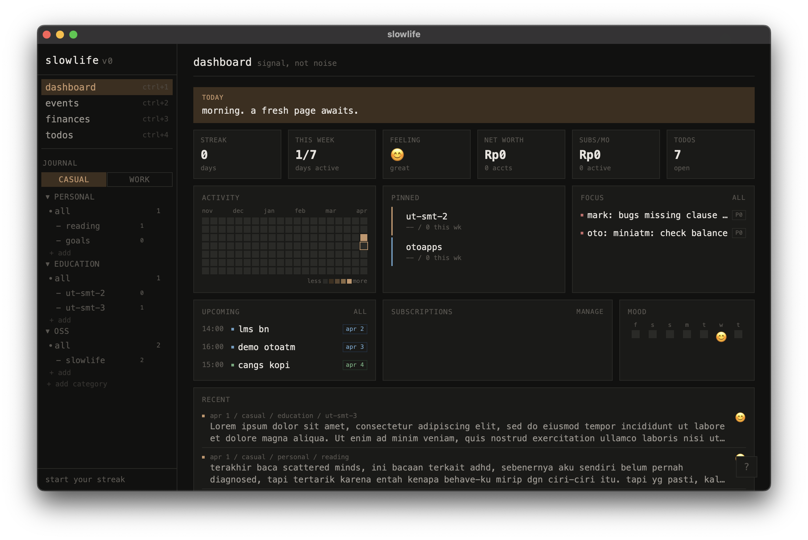

# slowlife


[](https://codecov.io/gh/addeeandra/slowlife)

Personal OS — designed to make everything feel in-place.

slowlife is a desktop-first journaling, todos, scheduling, and financial tracking app built with a brutalist, terminal-inspired aesthetic. It prioritizes signal over noise: no vanity metrics, no bloat — just the information you need to stay grounded.

<p align="center">
  
</p>

## Philosophy

- **Signal, not noise** — useful metrics over generic totals
- **Offline-first** — your data lives on your machine, always available
- **Typography-first** — monospace, dense, no decoration for decoration's sake
- **Structured, not scattered** — hierarchical spaces instead of flat tags

## Features

### Journal
- **Dual spaces**: Casual and Work
- **Hierarchy**: Space > Category > Project
- **Mood tracking**: per-entry snapshots
- **Writing prompts**: tailored by space
- **Tags**: scoped to each space

### Dashboard
- **Signal cards**: streaks, mood, net worth, burn, todos
- **Activity heatmap**: 20-week view
- **Pinned journals**: recent activity at a glance
- **Mood trend**: 7-day view
- **Upcoming items**: events, renewals, focus todos
- **Inattentive rate**: daily/weekly inattentive behavior tracking with ratio visualization

### Events
- **Coverage**: meetings, agendas, and holidays
- **Grouping**: by date with type badges
- **List view**: upcoming-first
- **Google Calendar sync**: one-way, read-only
- **Synced events**: link back to Google Calendar

### Todos
- **Priority**: P0 to P4
- **Complexity**: C0 to C4
- **Workflow**: open, in progress, done, cancelled
- **Assignment**: space, category, or project
- **Due dates**: with overdue detection
- **Views**: group, filter, and sort
- **Focus rate**: inattentive task detection (auto + manual flag) with R = i/(a+i) metric

### Finances
- **Accounts**: ledger-based balances from initial balance + transactions
- **Adjustments**: reconcile account balance with automatic diff transactions
- **Transactions**: income, expenses, categories, and account filters
- **Budgeting**: monthly category budgets with over-budget signals
- **Reports**: income vs expense trend and net worth history
- **Subscriptions**: active/cancelled tracking, grouped by billing cycle
- **Currency**: base-currency totals with manual local exchange rates (IDR, USD, SGD, CNY)

### Focus Mode
- **Context-locked view**: pick a category or project and hide everything else
- **All-in-one panel**: journal editor, todos, and upcoming events for the chosen context
- **Persistent target**: last-used focus context is remembered across sessions
- **Sidebar-free**: sidebar and FAB are hidden; exit via Esc or the exit button

### Desktop Experience
- **Runtime**: native app via Tauri
- **Database**: local SQLite
- **Command palette**: Ctrl+K for global search and navigation
- **Shortcuts**: navigation, quick capture (Ctrl+N), focus mode (Ctrl+0), sidebar toggle (Ctrl+S)
- **Sidebar toggle**: collapsible on desktop, overlay on mobile
- **System tray**: supported

## Roadmap Preview

See [ROADMAP.md](ROADMAP.md) for the full roadmap. Key upcoming milestones:

- [x] Global quick capture (system-wide shortcut)
- [x] Calendar views and event CRUD
- [x] Calendar sync (Google Calendar, read-only)
- [x] Todos with priority/complexity scoring
- [x] Financial CRUD, reporting, and multi-currency tracking
- [x] Full-text search and command palette (Ctrl+K)
- [ ] cr-sqlite for cross-device sync
- [ ] Mobile support via Tauri v2

## Tech Stack

| Layer | Choice |
|-------|--------|
| Shell | Tauri v2 |
| Frontend | Vue 3 + TypeScript + Vite |
| Data | SQLite via tauri-plugin-sql |
| Styling | Custom CSS with design tokens |
| Routing | Vue Router 4 |

## Getting Started

### Prerequisites

- [Node.js](https://nodejs.org/) >= 18
- [pnpm](https://pnpm.io/)
- [Rust](https://www.rust-lang.org/tools/install) (stable)
- Tauri v2 system dependencies — see [Tauri prerequisites](https://v2.tauri.app/start/prerequisites/)

### Setup

```bash
git clone https://github.com/addeeandra/slowlife.git
cd slowlife-app
pnpm install
```

### Development

```bash
pnpm tauri:dev
```

Dev and production are intentionally isolated:

- dev app identifier: `com.addeeandra.slowlife.dev`
- prod app identifier: `com.addeeandra.slowlife`
- dev database: `slowlife-dev.db`
- prod database: `slowlife.db`

### Build it urself

```bash
pnpm tauri build
```

## Contributing

See [CONTRIBUTING.md](CONTRIBUTING.md) for guidelines.

## License

Slowlife is open-sourced software licensed under the [MIT license](LICENSE).
